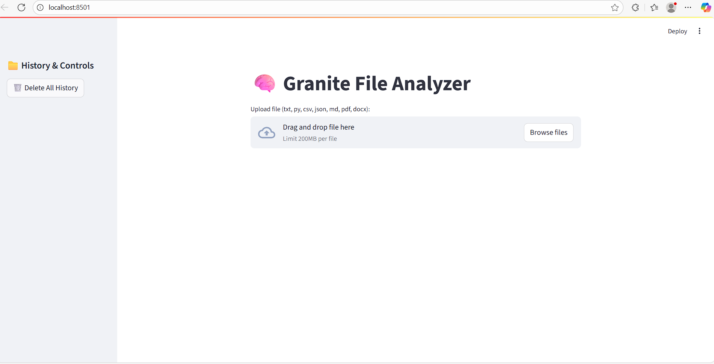
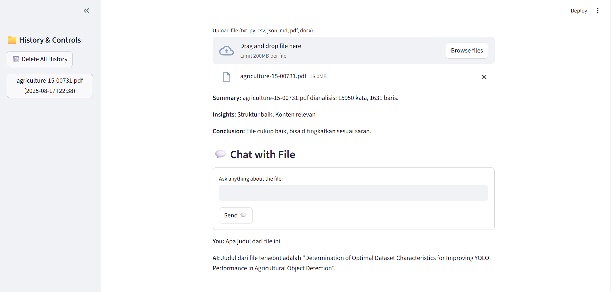
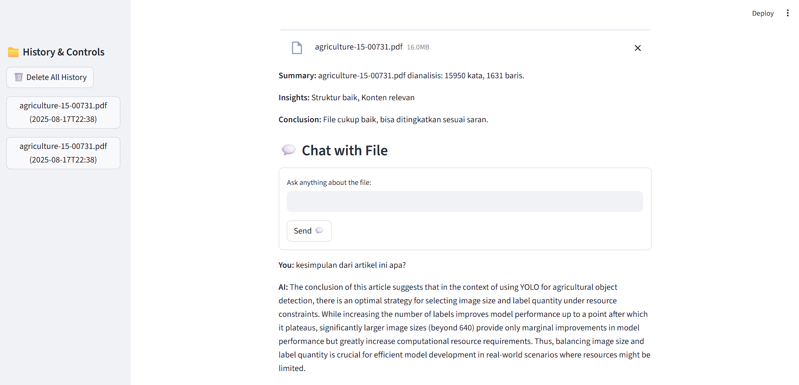

# Granite-File-Analyzer

Granite File Analyzer is an interactive web application based on Streamlit for analyzing and interacting with various types of files (txt, py, csv, json, md, pdf, docx). This application also supports a chat feature with file content using an AI model based on LM Studio (Granite).

## 📂 Folder Structure

```
Granite-File-Analyzer/
├── Granite_app.py
├── requirements.txt
├── README.md
└── png/
    ├── 1.png
    ├── 2.png
    └── 3.png
```

## ⚡ Main Features

- **File upload**: Supports various file formats such as txt, py, csv, json, md, pdf, and docx.
- **Automatic summary**: Provides information on word count and lines in the file.
- **Content analysis**: Delivers insights and conclusions based on file content.
- **Interactive chat**: Interact directly with file content using AI model ibm/granite-3.2-8b from LM Studio.
- **Analysis history**: Stores up to 20 recently analyzed files, with option to clear all history.

## 🛠 Installation & Local Setup

**Clone repository:**
```bash
git clone https://github.com/Trisaputraezha/Granite-File-Analyzer.git
cd Granite-File-Analyzer
```

**Install dependencies:**
```bash
pip install -r requirements.txt
```

**Requirements.txt contents:**
```
streamlit
PyPDF2
python-docx
requests
```

**Run application:**
```bash
streamlit run Granite_app.py
```

**Access application in browser at:**
```
http://localhost:8501
```

## 🔗 LM Studio Configuration
#### Download & Install LMStudio
1. Download LM Studio from: https://lmstudio.ai/
2. Install according to your operating system.

#### Download Model LLaVA
1. Open LM Studio → Go to the Discover tab
2. Search for "ibm/granite-3.2-8b"
3. Download one of the models:
   - https://lmstudio.ai/models/ibm/granite-3.2-8b(the one I use)

#### Start LMStudio Server
1. Go to the Chat tab → Load the LLaVA model
2. Go to the Local Server tab
3. Select model ibm/granite-3.2-8b
4. Click Start Server
5. Make sure the server is running at localhost:1234

**LM Studio URL**: Make sure LM Studio is running and accessible at the following URL:
```
http://127.0.0.1:1234/v1
```

**AI Model**: Use model `ibm/granite-3.2-8b` for analysis and interactive chat.

## Application Test

### 1️⃣ File Upload Interface


### 2️⃣ File Summary & Title


### 3️⃣ Interactive Chat & Conclusion
